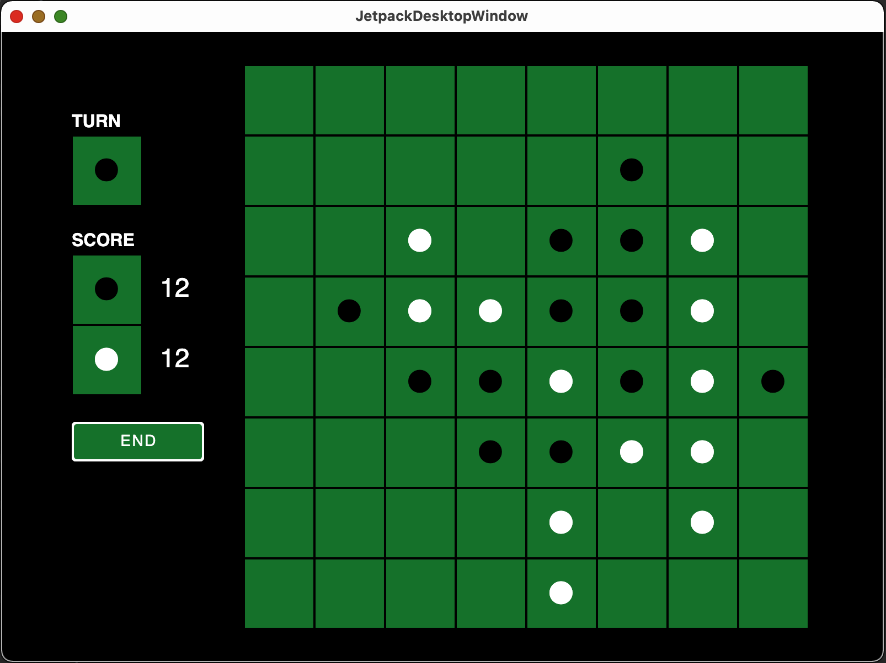
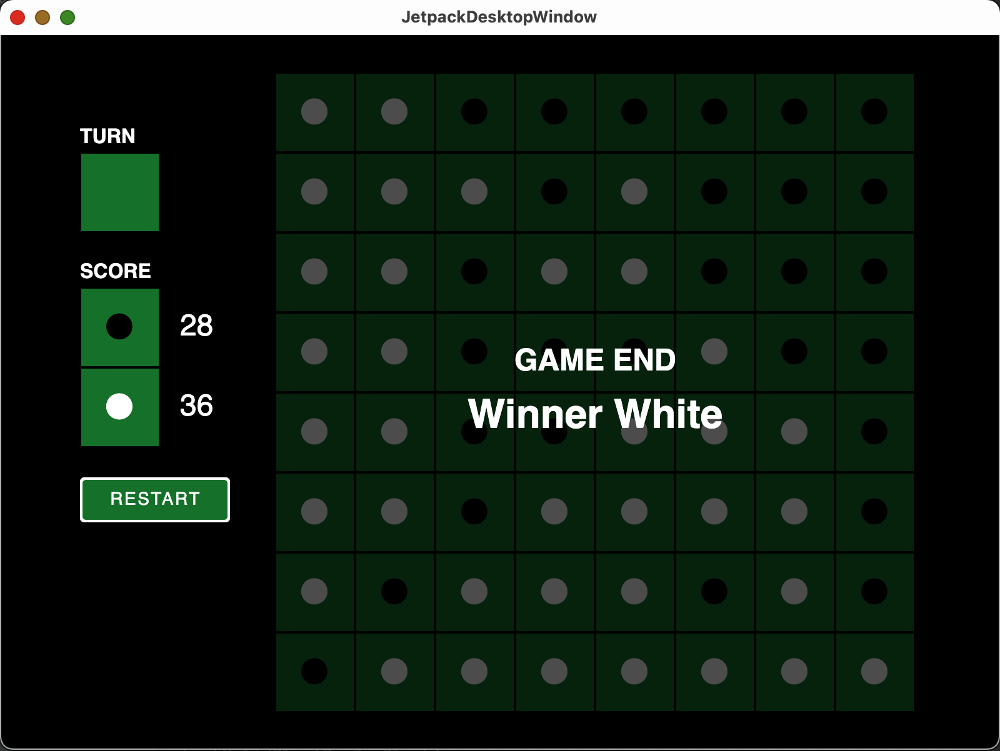

# OthelloPackComposeDesktop

Othello game made of JetPack compose desktop.
For [Compose for Desktop](https://www.jetbrains.com/lp/compose/) learning.

## ScreenShot

| GAME | GAME END |
|:----:|:--------:|
|  |  |

## How to Build

```shell
# Run
$./gradlew run
# Test
$./gradlew test
```